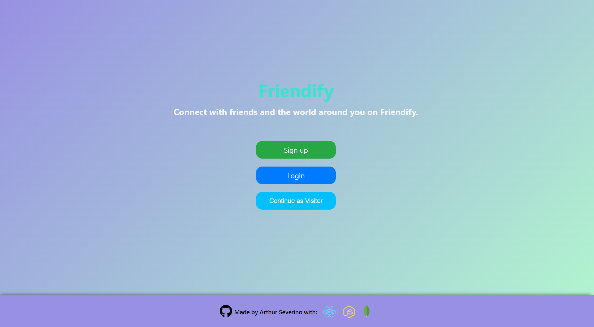

Live: https://friendify-afc27231acd7.herokuapp.com

# Friendify

Friendify is a full-stack social media website created with the MERN stack. It's designed to help people stay connected with their friends, share updates, and discover new content.

## Features

Friendify includes the following features:

- JWT authentication with Passport.js.
- CRUD operations for posts and comments
- AWS cloud storage for user images
- Real-time feed of posts from friends
- Ability to like posts and comments
- Log into the website as a visitor.
- Responsive design

... and much more!

## Dependencies

The following dependencies are used in this project:

- react: JavaScript library for building user interfaces.
- react-router-dom: Routing library for React.
- aws-sdk: Handles AWS S3 Bucket file storage for user-uploaded images
- express: Web application framework for Node.js.
- mongoose: Object Data Modeling library for MongoDB.
- bcryptjs: Handles Hashing passwords
- express-validator: Runs back-end validation for form data.
- passport: Authentication middleware for Node.js.
- passport-jwt: Passport strategy for authenticating with JWT tokens.
- jsonwebtoken: JSON Web Token implementation for Node.js.
- multer: Handles multiform FormData.
- cors: Handles CORS.

## Pages

The website includes the following pages:

- /index: Displays login and sign-up forms.
- /home: The home page includes a feed of posts from the user and their friends.
- /friends: Displays a list of users including suggestions for users to follow.
- /posts: Displays a list of all posts from all users.
- /profile: Displays the user's profile page and a feed of the user's posts.
