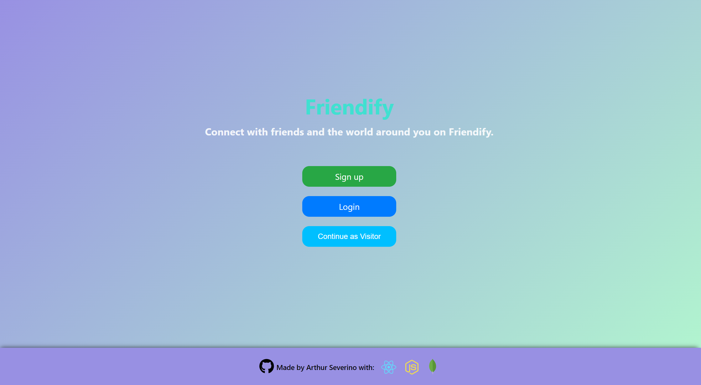
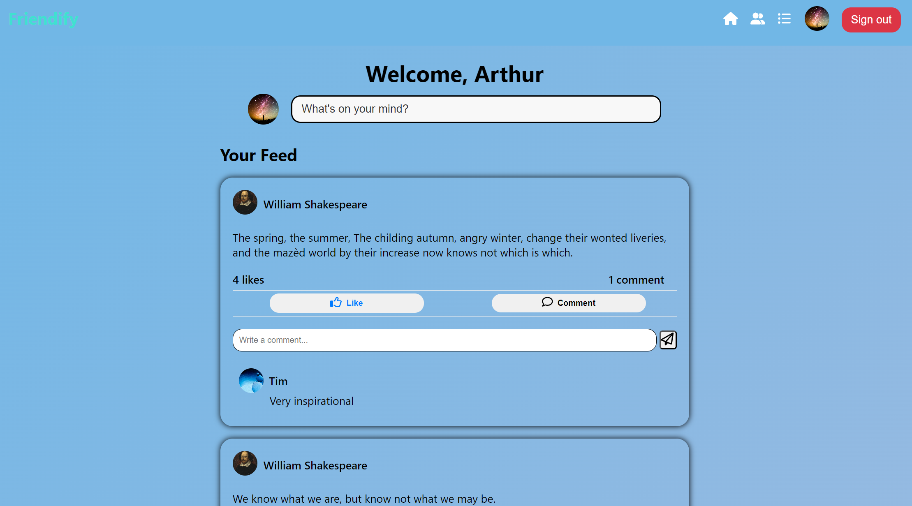
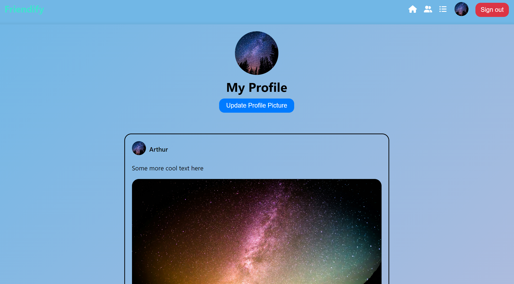
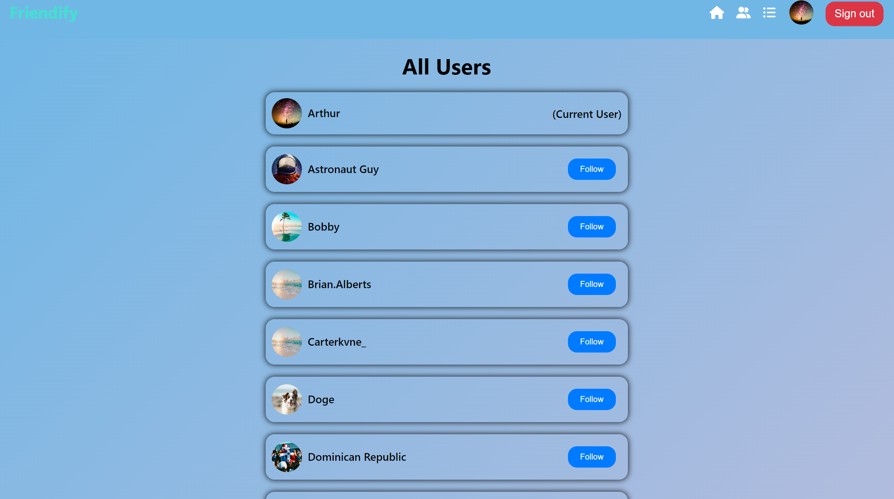

# Live Preview 
https://friendify-afc27231acd7.herokuapp.com

# Friendify

Friendify is a full-stack social media website built with React, Express, and PostgreSQL (via Prisma). It is designed to help people stay connected with friends, share updates, and discover new content.

## Getting Started

To get started with the website, follow these steps:

1. Clone the repository to your local machine.
2. Install dependencies:
   - `cd backend && npm install`
   - `cd ../frontend && npm install`
3. Create backend env variables in `backend/.env`:
   - `DATABASE_URL`
   - `JWT_SECRET`
   - Bucketeer/AWS vars if you want image uploads
4. Run Prisma migration:
   - `cd backend && npm run prisma:migrate:dev`
5. Start apps:
   - Backend: `cd backend && npm run dev`
   - Frontend: `cd frontend && npm run dev`

## Features

Friendify includes the following features:

- JWT authentication with Passport.js.
- CRUD operations for posts and comments
- AWS cloud storage for user images
- Real-time feed of posts from friends
- Ability to like posts and comments
- Responsive design

... and much more!

## Dependencies

The following dependencies are used in this project:

- react: JavaScript library for building user interfaces.
- react-router-dom: Routing library for React.
- aws-sdk: Handles AWS S3 Bucket file storage for user-uploaded images
- express: Web application framework for Node.js.
- prisma + @prisma/client: ORM and query client for PostgreSQL.
- pg: PostgreSQL driver.
- supertest: HTTP testings.
- jest: Jest test frameworks.
- bcryptjs: Handles Hashing passwords
- express-validator: Runs back-end validation for form data.
- passport-jwt: Passport strategy for authenticating with JWT tokens.
- jsonwebtoken: JSON Web Token implementation for Node.js.
- multer: Handles multiform FormData.
- cors: Handles CORS.

## Pages

The website includes the following pages:

- `/`: Displays login and sign-up forms.
- `/api/users/:userId/posts`: Home feed for followed users + self.
- `/api/users/:id`: Profile page and user posts.
- `/api/users`: User discovery and follow actions.

## Screenshots 

### Index Page

### Home Page

### Profile Page

### Users Page 

## Contributing to Friendify

Contributions are welcome! To contribute to Friendify, follow these steps:

1. Fork the repository.
2. Create a branch: `git checkout -b <branch_name>`.
3. Make your changes and commit them: `git commit -m '<commit_message>'`
4. Push to the original branch.
5. Create the pull request.

## Contact

If you want to contact me you can reach me at <aas1181@nyu.edu>.

## License

This project is licensed under the MIT License. See the LICENSE file for details.